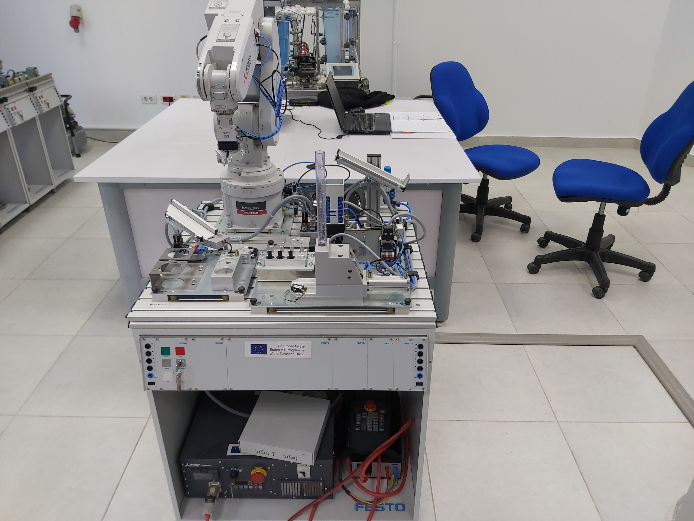

# CIROS-Programming-of-Mitsubishi-RV-2FB-Robot-Arm
This repository includes the programming of a  Mitsubishi RV-2FB robot arm programmed using CIROS education software in FESTO professional diploma at the FACT training center.

<!-- 
 -->

<!-- 

 -->

  
   

